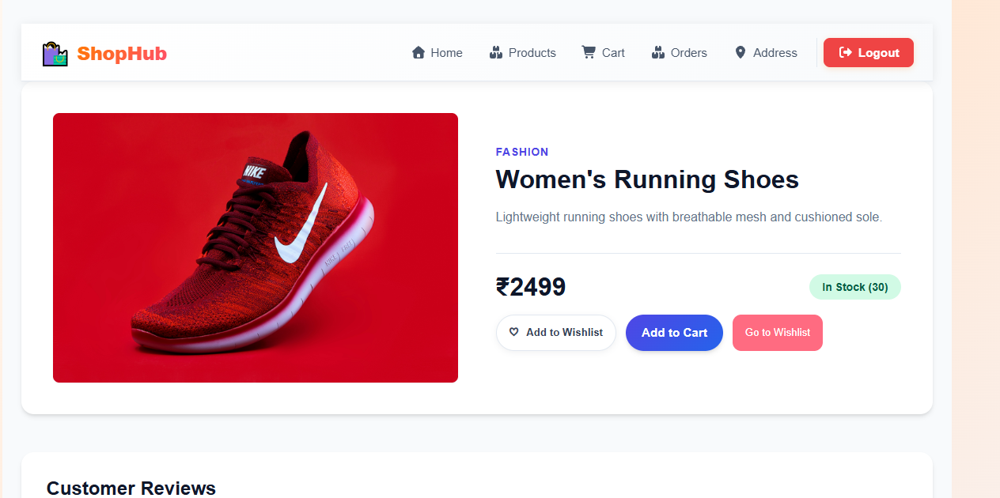
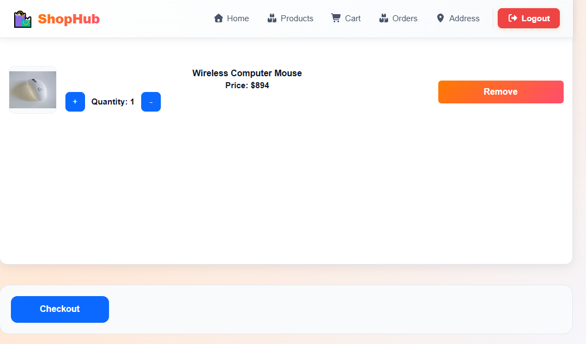
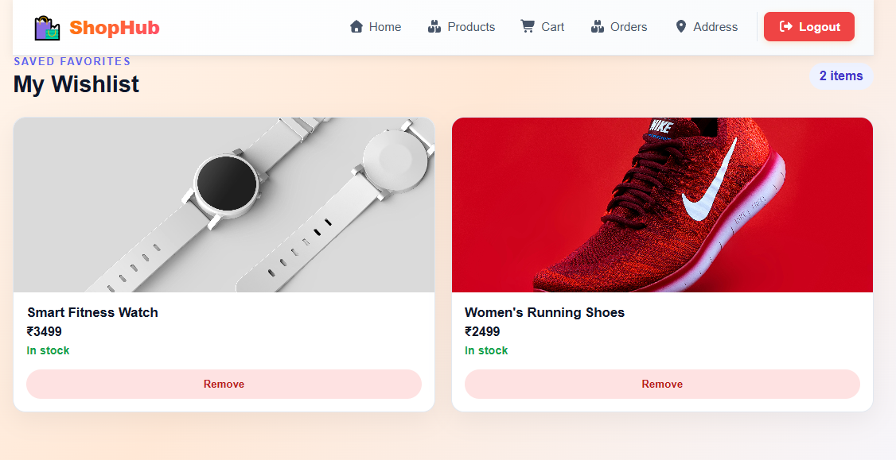
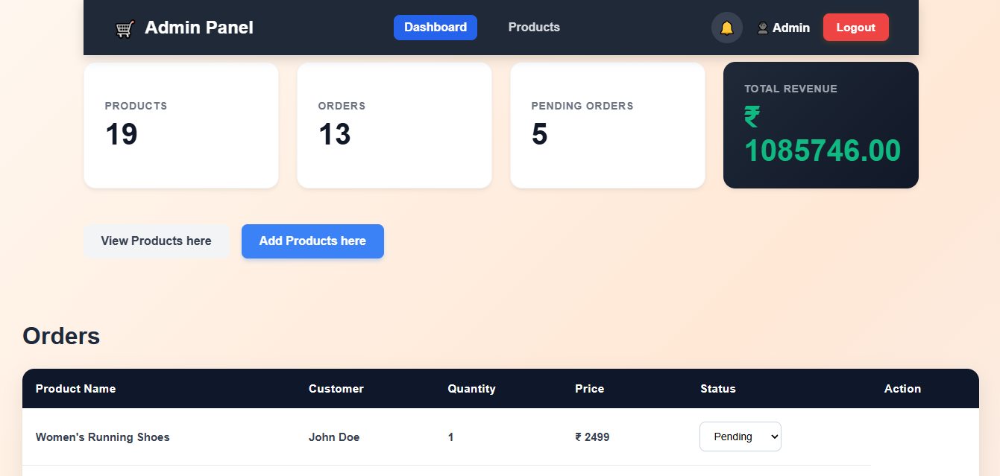

    # AI-Powered MERN E-Commerce Platform

    A full-stack E-Commerce application built using the MERN stack with AI-powered product assistance, authentication, wishlist management, reviews, cart functionality, and order management.

    ## Live Demo

    **Frontend:**
    https://ecommerce-web-jerin4.vercel.app

    **Backend API:**
    https://ecommerce-web-fc8w.onrender.com

    ---

    ## Features

    ### User Features

    * User Registration and Login
    * JWT Authentication & Authorization
    * Browse Products
    * Product Details Page
    * Shopping Cart Management
    * Wishlist Management
    * Product Reviews & Ratings
    * Place Orders
    * View Order History
    * Responsive User Interface

    ### Admin Features

    * Secure Admin Access
    * Create Products
    * Update Products
    * Delete Products
    * View All Orders
    * Update Order Status
    * Dashboard Overview

    ### AI Features

    * Google Gemini API Integration
    * AI-assisted shopping experience
    * Intelligent product-related interactions

    ---

    ## Tech Stack

    ### Frontend

    * React.js
    * React Router
    * CSS3
    * Fetch API

    ### Backend

    * Node.js
    * Express.js

    ### Database

    * MongoDB
    * Mongoose

    ### Authentication

    * JSON Web Token (JWT)

    ### AI Integration

    * Google Gemini API

    ### Deployment

    * Frontend: Vercel
    * Backend: Render

    ---

    ## Project Structure

    ```text
    Ecommerce-web/
    ├── Frontend/
    │   ├── src/
    │   ├── public/
    │   └── package.json
    │
    ├── Backend/
    │   ├── controllers/
    │   ├── models/
    │   ├── routes/
    │   ├── middleware/
    │   ├── config/
    │   └── server.js
    │
    └── README.md
    ```

    ## Installation

    ### Clone Repository

    ```bash
    git clone https://github.com/Jerin34/Ecommerce-web.git
    cd Ecommerce-web
    ```

    ### Backend Setup

    ```bash
    cd Backend
    npm install
    npm start
    ```

    ### Frontend Setup

    ```bash
    cd Frontend
    npm install
    npm start
    ```

    ---

    ## Environment Variables

    ### Backend (.env)

    ```env
    PORT=5000
    MONGO_URI=your_mongodb_connection_string
    JWT_SECRET=your_jwt_secret
    GEMINI_API_KEY=your_gemini_api_key
    ```

    ### Frontend (.env)

    ```env
    REACT_APP_API_URL=https://your-backend-url.com
    ```

    ---

    ## API Features

    ### Authentication

    * Register User
    * Login User
    * Protected Routes
    * Role-Based Authorization

    ### Products

    * Create Product
    * Get Products
    * Get Product Details
    * Update Product
    * Delete Product

    ### Cart

    * Add to Cart
    * Update Quantity
    * Remove Item
    * View Cart

    ### Wishlist

    * Add to Wishlist
    * Remove from Wishlist
    * View Wishlist

    ### Reviews

    * Add Review
    * View Reviews
    * Rating System

    ### Orders

    * Create Order
    * View User Orders
    * Admin Order Management

    ---
    ## Screenshots

    ### Home Page

    

    ### Product Details

    

    ### Cart

    

    ### Wishlist

    
    ### Admin Page
    

    ## Future Improvements

    * Online Payment Integration (Stripe/Razorpay)
    * Cloudinary Image Uploads
    * Email Notifications
    * Inventory Analytics
    * Order Tracking
    * AI Product Recommendations

    ---

    ## Learning Outcomes

    This project helped me gain hands-on experience with:

    * Full Stack MERN Development
    * REST API Design
    * Authentication & Authorization
    * MongoDB Database Design
    * React State Management
    * Deployment on Vercel & Render
    * AI Integration using Google Gemini
    * Production Debugging & Deployment

    ---

    ## Author

    **Jerin Benny**

    GitHub: https://github.com/Jerin34

    If you found this project helpful, feel free to star the repository.
